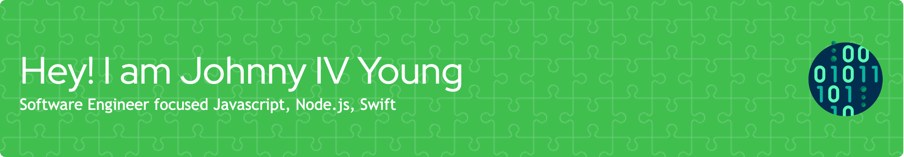

**<h3 align="left">Connect with me:</h3>** 

  

 **<h3 align="left">🚀 Passionate full-stack web developer, creating robust and scalable web applications. Skilled in both front-end and back-end technologies, with a keen eye for user experience and performance optimization.</h3>**

 **<h3 align="left">Skills</h3>**

       

 **<h3 align="left">GitHub Stats</h3>**

  
  

  

 **<h3 align="left">Support Me</h3>**

